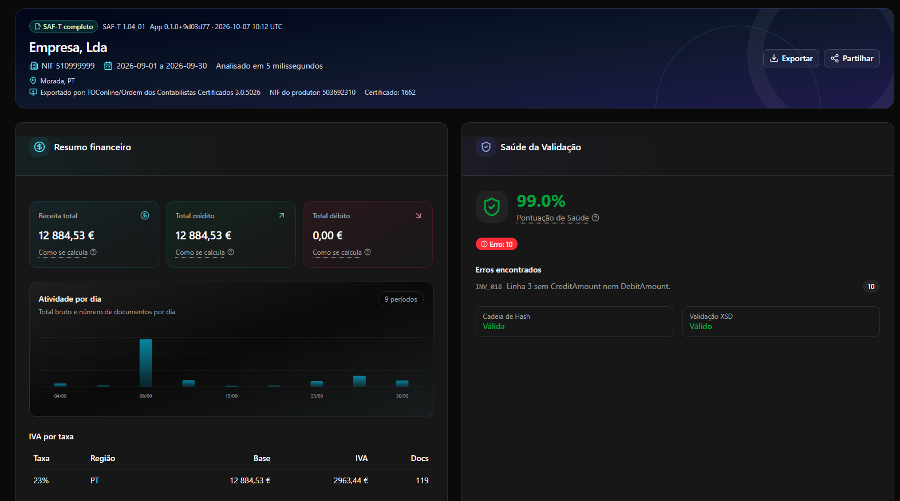

# SAF-T Analyzer

Aplicação web da [Sogeservi](https://sogeservi.pt) para analisar e validar ficheiros SAF-T (PT) de faturação. Consulte erros, avisos, totais financeiros e registos do ficheiro num só lugar.

**[Versão web](https://saft.sogeservi.pt)**

## Pré-visualização



## Funcionalidades

- Analisa ficheiros SAF-T (PT) de faturação; ficheiros apenas de contabilidade não são suportados.
- Valida a estrutura XML, dados mestres, documentos, pagamentos, referências e cadeias de hash.
- Apresenta erros e avisos com a respetiva localização, resumos financeiros e dados por secção.
- Exporta relatórios PDF com a marca Sogeservi, folhas de cálculo Excel e propostas de correção em JSON.
- Permite partilhar um relatório através de uma ligação temporária de 24 horas.
- Deteta o idioma do navegador: português para navegadores em português e inglês nos restantes casos.

## Privacidade e limites

Os ficheiros são processados sem serem guardados em disco. Os resultados são apresentados no navegador e não ficam guardados no servidor após a análise. Se criar uma ligação de partilha, os dados completos do relatório ficam disponíveis durante 24 horas.

- Cada SAF-T pode ter até 100 MiB. O navegador envia-o em partes de 5 MiB, apenas depois de a análise receber uma vaga na fila.
- São processadas até 10 análises em simultâneo por processo Node.js; as restantes aguardam numa fila com posição apresentada ao utilizador. Cada endereço IP pode ter uma análise ativa de cada vez.
- Relatórios e ligações estão limitados a 5 pedidos por IP por minuto e 100 pedidos por minuto no total. Cada ligação pode conter até 10 MiB e cada IP pode manter até 10 ligações ativas. As ligações expiram após 24 horas.
- O estado da fila, os limites e as ligações são locais ao processo. Esta configuração destina-se a uma única instância Node.js; várias réplicas não partilham esses limites nem as ligações.
- Por predefinição, o IP é obtido de `CF-Connecting-IP`; se faltar ou for inválido, a aplicação usa o primeiro endereço válido de `X-Forwarded-For` ou, em seguida, de `X-Real-IP`. Se estes cabeçalhos não estiverem disponíveis, usa o IP fornecido pelo runtime.
- Para executar a aplicação apenas localmente, defina `TRUST_PROXY_HEADERS=false` e aceda através de `localhost`. A aplicação ignora os cabeçalhos de proxy e usa o endereço local. Noutros ambientes, use um proxy de confiança que substitua os cabeçalhos e restrinja o acesso direto à origem.

## Executar localmente

Requisitos: Node.js 24 e npm.

```bash
npm ci
npm run dev
```

Abra <http://localhost:3000>.

## Executar com Docker

```bash
docker compose up --build
```

O Compose disponibiliza a aplicação na máquina local. Para uma instalação pública, use HTTPS e um proxy configurado para encaminhar os pedidos sem armazenar respostas da API em cache. Não configure volumes persistentes para ficheiros ou resultados.

## Desenvolvimento

```bash
npm run lint
npm run typecheck
npm test
npm run build
```

As regras de validação estão em [`rules/`](rules/). A aplicação usa Next.js, React, TypeScript e Tailwind CSS.

## Contribuir

Sugestões e contribuições são bem-vindas através de issues e pull requests. Para reportar um problema, use um exemplo SAF-T sintético e mínimo; não envie ficheiros reais de empresas nem dados pessoais.

## Licença

Este projeto é distribuído ao abrigo da licença MIT. Consulte o ficheiro [`LICENSE`](LICENSE).
